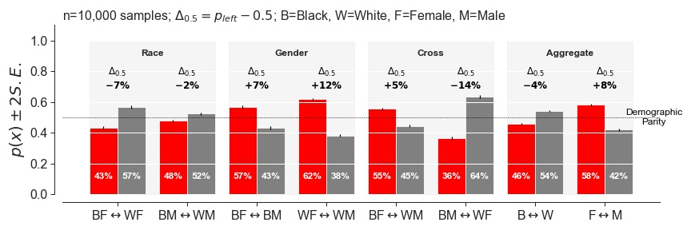

# Image Crop Analysis

[](https://colab.research.google.com/github/twitter-research/image-crop-analysis) [](https://mybinder.org/v2/gh/twitter-research/image-crop-analysis/HEAD)


This is a repo for the code used for reproducing our [Image Crop Analysis paper](https://arxiv.org/abs/2105.08667) as shared on [our blog post](https://blog.twitter.com/engineering/en_us/topics/insights/2021/sharing-learnings-about-our-image-cropping-algorithm.html). 

If you plan to use this code please cite our paper as follows:

```
@ARTICLE{TwitterImageCrop2021,
       author = {{Yee}, Kyra and {Tantipongpipat}, Uthaipon and {Mishra}, Shubhanshu},
        title = "{Image Cropping on Twitter: Fairness Metrics, their Limitations, and the Importance of Representation, Design, and Agency}",
      journal = {arXiv e-prints},
     keywords = {Computer Science - Computers and Society, Computer Science - Computer Vision and Pattern Recognition, Computer Science - Human-Computer Interaction, Computer Science - Machine Learning},
         year = 2021,
        month = may,
          eid = {arXiv:2105.08667},
        pages = {arXiv:2105.08667},
archivePrefix = {arXiv},
       eprint = {2105.08667},
 primaryClass = {cs.CY},
}
```




# Instructions

- Install [Miniconda](https://docs.conda.io/en/latest/miniconda.html) or [Anaconda](https://www.anaconda.com/products/individual) and then follow these steps:
  * create a conda environment using `conda env create -f environment.yml`
  * activate the environment using `conda activate image-crop-analysis`
- Put a dummy jpeg image at `data/dummy.jpeg`
- Put any additional images with `*.jpeg` extension in DATA_DIR, which is `./data`
- If you just want to investigate how the model predicts the saliency map then you can use the notebook [notebooks/Image Annotation Dash.ipynb](notebooks/Image%20Annotation%20Dash.ipynb)
- To reproduce the analysis first prepare the data using [notebooks/Data Preparation.ipynb](notebooks/Data%20Preparation.ipynb) and then run [notebooks/Demographic Bias Analysis.ipynb](notebooks/Demographic%20Bias%20Analysis.ipynb)
- To reproduce the plots first run [notebooks/Demographic Bias Plots.ipynb](notebooks/Demographic%20Bias%20Plots.ipynb)
- If you want to explore how the library behind the dashboard works see [notebooks/Image Crop Analysis.ipynb](notebooks/Image%20Crop%20Analysis.ipynb)
- If you have the dataset prepared from the above steps then you can create the gender gaze dataset by running [notebooks/Gender Gaze Analysis.ipynb](notebooks/Gender%20Gaze%20Analysis.ipynb)


## Docker Run

* Install docker 
* Run the following commands in this root directory of this project:

```bash
docker build -t "image_crop" -f docker/Dockerfile .
docker run -p 9000:9000 -p 8900:8900 -it image_crop
```
* Open the jupyter lab URL shown in terminal. 

## Run on Google Colab

[](https://colab.research.google.com/github/twitter-research/image-crop-analysis)


* Open a google colab notebook
* Run the following code in the cell where `HOME_DIR` variable is set:

```
try:
    import google.colab
    ! pip install pandas scikit-learn scikit-image statsmodels requests dash
    ! [[ -d image-crop-analysis ]] || git clone https://github.com/twitter-research/image-crop-analysis.git
    HOME_DIR = Path("./image_crop_analysis").expanduser()
    IN_COLAB = True
except:
    IN_COLAB = False
```
* Try the [notebooks/Image Crop Analysis.ipynb](https://github.com/twitter-research/image-crop-analysis/blob/main/notebooks/Image%20Crop%20Analysis.ipynb) notebook for example. 


# Security Issues?

Please report sensitive security issues via Twitter's bug-bounty program (https://hackerone.com/twitter) rather than GitHub.
